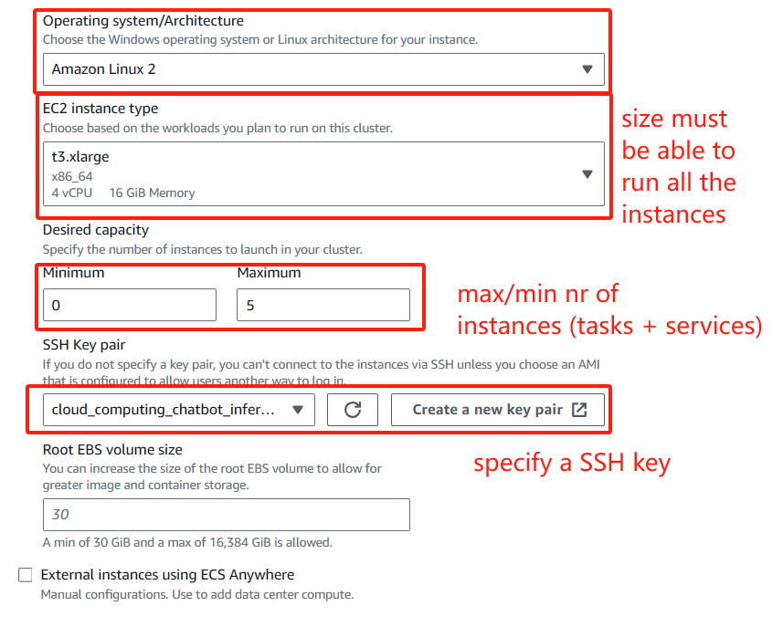

# Chatbot Team Project - Cloud Computing COMP-4312


The project contains three main components, each of them will be deployed in a separate server on cloud, they are

1. A web-based frontend based on React.js
2. An API server based on node.js and express.js, it should also store the chat history of the user
3. An inference server based on flask and openAI's API

To know how to start each components, please navigate to the README files in each folder.

- inference server: [README.md](./inference%20server/README.md)
- API server: [README.md](./API%20server/README.md)
- web server: [README.md](./web%20server/README.md)

## Inter-server communication

We will use JSON based REST API to handle inter-server communication, here are sample API's

### API server

- `/chat` method: **POST**

  request body

  ```json
  {
    "user_id": "jamesbond",
    "message": "how are you doing?"
  }
  ```

  response format

  ```json
  {
    "user_id": "jamesbond",
    "respond": "I'm good"
  }
  ```

- `/new_user` method: **POST**

  request body

  ```json
  {
    "user_id": "jamesbond",
    "personal_data": {
      "major": "computer science",
      "year": 4
      // add more if needed
    }
  }
  ```

  response format

  ```json
  {
    "status": true, // true=success, false=fail
    "message": "user added"
  }
  ```

- `/chat_history` method: **POST**

  request body

  ```json
  {
    "user_id": "jamesbond"
  }
  ```

  response format

  ```json
  {
    "user_id": "jamesbond",
    "chat_history": [
      {
        "sender": "USER",
        "message": "hello world, AI!",
        "timestamp": 123134123
      },
      {
        "sender": "BOT",
        "message": "hello world, user!",
        "timestamp": 123134123
      }
    ]
  }
  ```

### Inference server

inference server ONLY communicates with API server

- `/chat` method: **POST**

  request body

  there are **TWO** types of request body, the first is the one **without** checking calendar data

  ```json
  {
    "user_id": "yp83tx8S+ZNmf/1csl1vOA==", // encoded user id
    "chat_history": [
      {
        "sender": "USER",
        "message": "hello world, AI!",
        "timestamp": 123134123
      },
      {
        "sender": "BOT",
        "message": "hello world, user!",
        "timestamp": 123134123
      }
    ],
    "message": "how are you doing?",
    "timestamp": 123134123
  }
  ```

  response format

  ```json
  {
    "user_id": "yp83tx8S+ZNmf/1csl1vOA==", // encoded user id
    "respond": "I'm good"
  }
  ```

  if the model detect that this is a calendar-related question, it will response like this:

  ```json
  {
    "input_message": "Tom: Give me a calendar event for tomorrow at 10am",
    "input_classification": "calendar",
    "match_score": "100",
    "response": {
      "maxResults": "1",
      "orderBy": "startTime",
      "timeMin": "2024-01-28T10:00:00Z",
      "timeMax": "2024-01-28T11:00:00Z"
    }
  }
  ```

  the second is the one **with** calendar data

  request format:

  ```json
  {
    "user_id": "yp83tx8S+ZNmf/1csl1vOA==", // encoded user id
    "chat_history": [
      {
        "sender": "USER",
        "message": "hello world, AI!",
        "timestamp": 123134123
      },
      {
        "sender": "BOT",
        "message": "hello world, user!",
        "timestamp": 123134123
      }
    ],
    "calendar_response": [
      {
        "summary": "Astronomy II",
        "description": "Course:\\r\\nGSCI-2330-WDE\\r\\n\\r\\nTerm:\\r\\n2024W\\r\\n\\r\\nFaculty Info:\\r\\nN/A\\r\\n\\r\\nInstruction Method:\\r\\nWEB\\r\\n\\r\\nNo additional scheduling information available",
        "location": "N/A",
        "start": {
          "dateTime": "2024-01-08T00:00:00-05:00",
          "timeZone": "America/Toronto"
        },
        "end": {
          "dateTime": "2024-04-10T00:00:00-04:00",
          "timeZone": "America/Toronto"
        }
      }
    ],
    "message": "how are you doing?",
    "timestamp": 123134123
  }
  ```

  - `/new_user` method: **POST**

    add new user

    ```json
    {
        "user_id": "yp83tx8S+ZNmf/1csl1vOA=="",
        "personal_data": {
            "major": "computer science",
            "year": 4,
            "how_they_call_bot": "buddy",
            "how_bot_calls_them": "John",
            "pronouns": "he"
        }
    }
    ```

    response format

    ```json
    {
      "status": true, // true=success, false=fail
      "message": "user added"
    }
    ```

### Sample Google Calendar Event API Format

```json
{
  "kind": "calendar#event",
  "etag": "\"3413481354218000\"",
  "id": "00223ob3qggd6sbi5etfq8ga64",
  "status": "confirmed",
  "htmlLink": "https://www.google.com/calendar/event?eid=MDAyMjNvYjNxZ2dkNnNiaTVldGZxOGdhNjQgd2xpdTI5QGxha2VoZWFkdS5jYQ",
  "created": "2023-04-13T22:59:45.000Z",
  "updated": "2024-01-31T22:37:57.109Z",
  "summary": "Astronomy II",
  "description": "Course:\\r\\nGSCI-2330-WDE\\r\\n\\r\\nTerm:\\r\\n2024W\\r\\n\\r\\nFaculty Info:\\r\\nN/A\\r\\n\\r\\nInstruction Method:\\r\\nWEB\\r\\n\\r\\nNo additional scheduling information available",
  "location": "N/A",
  "creator": {
    "email": "mailadmin@lakeheadu.ca"
  },
  "organizer": {
    "email": "lakeheadu.ca_9e40dhbtkcf82keahborn25vjk@group.calendar.google.com",
    "displayName": "GSCI"
  },
  "start": {
    "dateTime": "2024-01-08T00:00:00-05:00",
    "timeZone": "America/Toronto"
  },
  "end": {
    "dateTime": "2024-04-10T00:00:00-04:00",
    "timeZone": "America/Toronto"
  },
  "iCalUID": "00223ob3qggd6sbi5etfq8ga64@google.com",
  "sequence": 0,
  "attendees": [
    {
      "email": "wliu29@lakeheadu.ca",
      "self": true,
      "responseStatus": "accepted"
    }
  ],
  "guestsCanInviteOthers": false,
  "guestsCanSeeOtherGuests": false,
  "reminders": {
    "useDefault": true
  },
  "eventType": "default"
}
```

# Setup Elastic Container Service





```bash
aws ecr get-login-password --region us-east-1 | docker login --username AWS --password-stdin 851725519353.dkr.ecr.us-east-1.amazonaws.com
```
